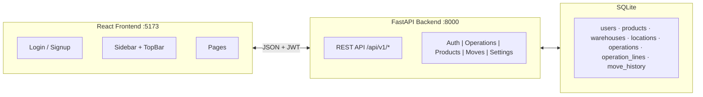
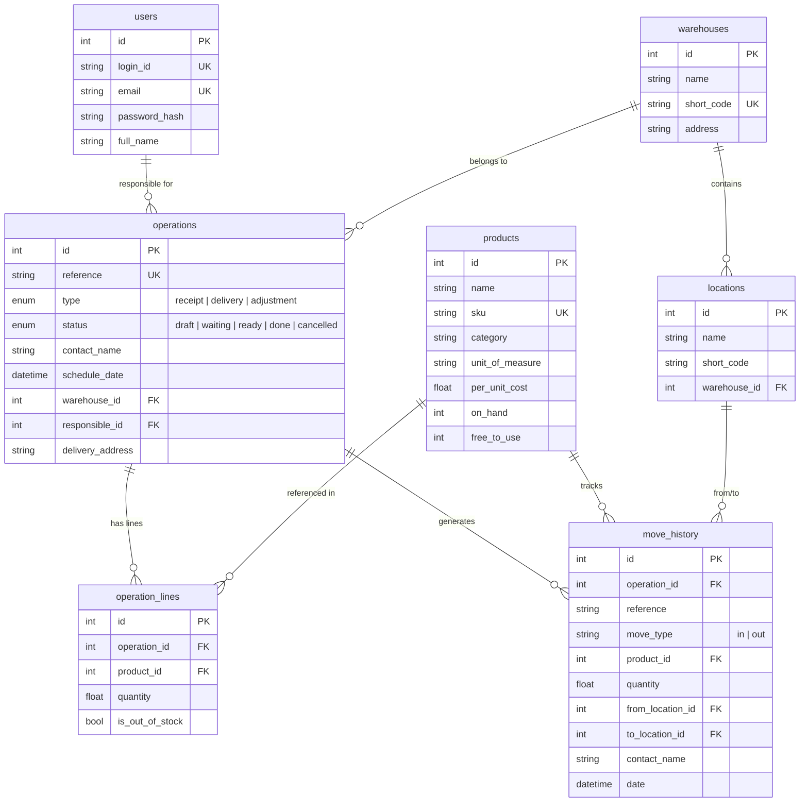
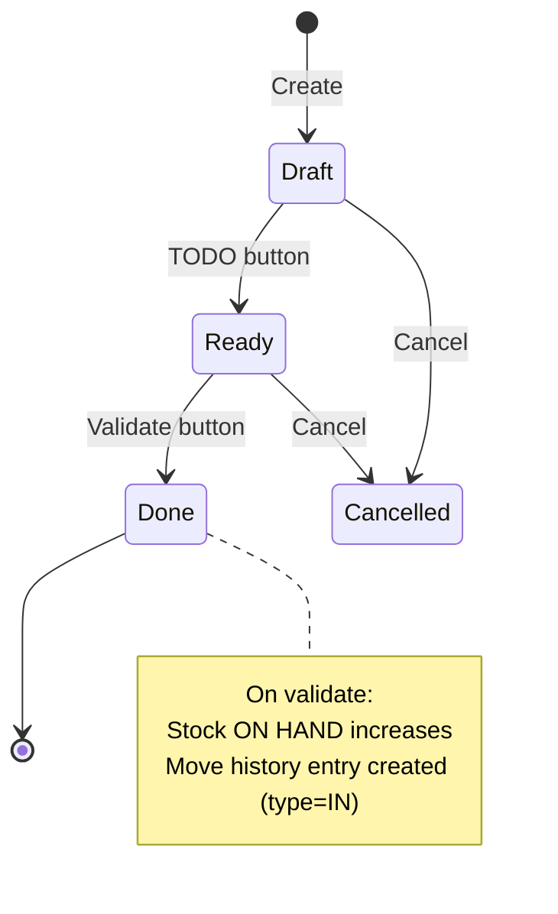
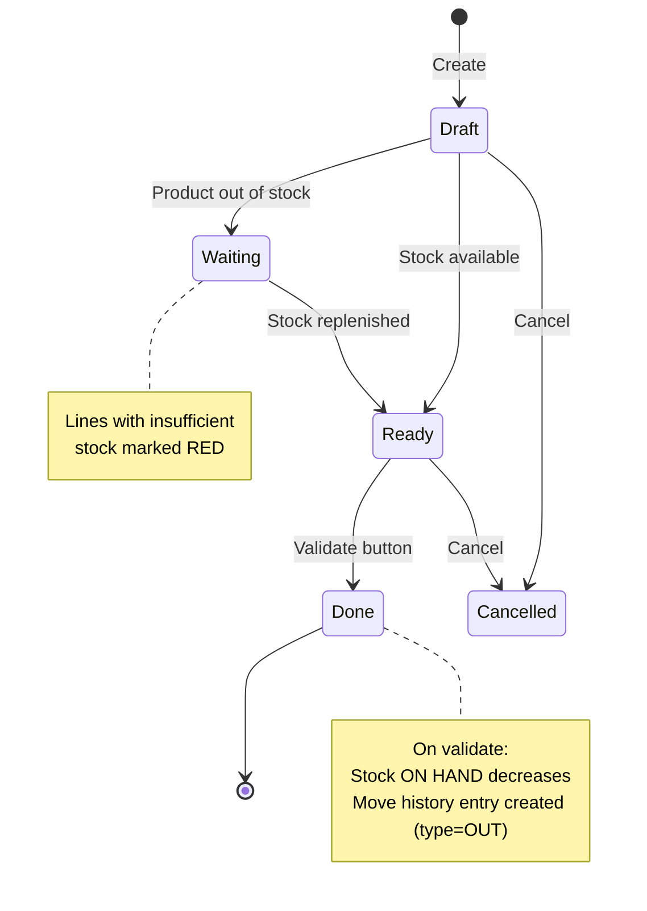

# StockSense — Implementation Plan

## Goal

Build **StockSense**, a modular Inventory Management System for a hackathon (~8 hours). Replace manual stock tracking with a centralized web app covering receipts, deliveries, product stock, move history, and multi-warehouse settings.

**Tech Stack:** React (Vite + TypeScript) + TailwindCSS | FastAPI (Python) + SQLite

---

## Scope Decisions

### ✅ In Scope (fully functional)
- Login / Signup with full validation (per Excalidraw rules)
- Dashboard with KPI cards (receipt & delivery stats)
- Receipts — list view, form, state machine (Draft → Ready → Done)
- Deliveries — list view, form, state machine (Draft → Waiting → Ready → Done)
- Products/Stock — table with CRUD, inline stock updates
- Move History — color-coded table, date filters, search
- Settings — Warehouse & Location CRUD
- Auto-incrementing references (`WH/IN/0001`, `WH/OUT/0001`)
- Sidebar navigation matching Excalidraw layout

### ⚠️ Simplified / Stub
- **Forget Password** — UI link present, no email/OTP integration
- **Print** — basic browser print (`window.print()`)
- **Kanban view toggle** — stretch goal, list view is primary

### ❌ De-prioritized
- Product categories & reordering rules
- Internal transfers (separate from receipts/deliveries)
- Mobile-optimized layout

---

## Open Questions

> [!IMPORTANT]
> **1. Deployment:** Is running locally enough for the demo, or do you need it hosted somewhere?

> [!IMPORTANT]
> **2. Seed data:** Should I pre-populate sample products, warehouses, and operations so the demo looks rich out of the box?

> [!IMPORTANT]
> **3. Stock Adjustments:** The Excalidraw has no dedicated wireframe for this. Should I model it as a simple form (select product → enter counted quantity → system auto-corrects)?

---

## Architecture



---

## Database Design



---

## Page-by-Page Design (matching Excalidraw)

### Login Page
- Centered card with App Logo
- Fields: Login ID, Password
- "SIGN IN" button
- Footer: "Forget Password? | Sign Up" links
- Validation: match credentials → error "Invalid Login Id or Password" on failure

### Signup Page
- Centered card with App Logo
- Fields: Login ID, Email, Password, Re-Enter Password
- "SIGN UP" button
- **Validation rules (from Excalidraw):**
  - Login ID: unique, 6–12 alphanumeric characters
  - Email: unique, valid format
  - Password: 8+ chars, must include lowercase + uppercase + special character
  - Re-Enter Password: must match

### Dashboard
- Two prominent KPI cards side by side:
  - **Receipt card:** "X to receive", "Y Late", "Z operations"
  - **Delivery card:** "X to Deliver", "Y Late", "Z waiting", "W operations"
- Late = schedule date < today · Waiting = status is "waiting"

### Sidebar Navigation
- User avatar circle ("A" = first letter) at top
- Menu items: Dashboard · Operations (submenu: Receipts, Delivery, Adjustment) · Products · Move History · Settings (submenu: Warehouse, Locations)
- Logout at bottom

### Receipts List
- Default: list/table view
- Columns: Reference | Contact | Schedule Date | Status
- Search bar filtering by reference & contact
- "NEW" button to create
- Status badges with color coding

### Receipt Form
- Header: "Receipt" + auto-generated reference (e.g. `WH/IN/0001`)
- Status stepper: **Draft → Ready → Done**
- Fields: Receive From, Schedule Date, Responsible (auto-filled with logged-in user)
- Products table: Product | Quantity — with "+ New Product" row
- Action buttons:
  - **TODO** (visible in Draft) → moves to Ready
  - **Validate** (visible in Ready) → moves to Done, **stock increases**
  - **Print** (visible in Done)
  - **Cancel** (always visible except Done)

### Delivery List
- Same structure as Receipts List but references are `WH/OUT/xxxx`

### Delivery Form
- Header: "Delivery" + reference `WH/OUT/0001`
- Status stepper: **Draft → Waiting → Ready → Done**
- Fields: Delivery Address, Schedule Date, Operation Type, Responsible
- Products table with out-of-stock alert (red highlight on line if insufficient stock)
- On Validate: **stock decreases**

### Products / Stock Page
- Table: Product | Per Unit Cost | On Hand | Free to Use
- "Add New Product" button
- Inline editing / update capability for stock quantities
- Product creation form: Name, SKU, Category, Unit of Measure, Per Unit Cost

### Move History Page
- Table: Reference | Contact | From | To | Quantity | Status | Date
- **IN moves = green row background, OUT moves = red row background**
- Multiple rows per reference if multiple products
- Date range filter (From / To date pickers)
- Search by reference & contact
- "NEW" button for manual entries

### Settings — Warehouse
- Form: Name, Short Code, Address
- List of existing warehouses

### Settings — Locations
- Form: Name, Short Code, Warehouse (dropdown)
- Table listing locations grouped by warehouse

---

## Operation State Machines

### Receipt Flow


### Delivery Flow


---

## Reference Number Format

Per Excalidraw spec:

```
<Warehouse Short Code> / <Operation> / <Auto-increment ID>

Examples:
  WH/IN/0001   (1st receipt at warehouse "WH")
  WH/OUT/0001  (1st delivery at warehouse "WH")
  WH/IN/0002   (2nd receipt)
```

---

## API Route Map

| Area | Method | Route | Purpose |
|------|--------|-------|---------|
| **Auth** | POST | `/api/v1/auth/signup` | Register user |
| | POST | `/api/v1/auth/login` | Login → JWT |
| | GET | `/api/v1/auth/me` | Current user profile |
| **Dashboard** | GET | `/api/v1/dashboard/stats` | KPI statistics |
| **Operations** | GET | `/api/v1/operations?type=receipt` | List receipts |
| | GET | `/api/v1/operations?type=delivery` | List deliveries |
| | POST | `/api/v1/operations` | Create operation |
| | GET | `/api/v1/operations/{id}` | Operation detail |
| | PUT | `/api/v1/operations/{id}` | Update operation |
| | POST | `/api/v1/operations/{id}/todo` | Draft → Ready |
| | POST | `/api/v1/operations/{id}/validate` | Ready → Done (updates stock) |
| | POST | `/api/v1/operations/{id}/cancel` | Cancel operation |
| **Products** | GET | `/api/v1/products` | List products |
| | POST | `/api/v1/products` | Create product |
| | PUT | `/api/v1/products/{id}` | Update product/stock |
| | DELETE | `/api/v1/products/{id}` | Delete product |
| **Moves** | GET | `/api/v1/moves?from=&to=` | Move history with date filter |
| **Settings** | GET | `/api/v1/settings/warehouses` | List warehouses |
| | POST | `/api/v1/settings/warehouses` | Create warehouse |
| | PUT | `/api/v1/settings/warehouses/{id}` | Update warehouse |
| | GET | `/api/v1/settings/locations` | List locations |
| | POST | `/api/v1/settings/locations` | Create location |
| | PUT | `/api/v1/settings/locations/{id}` | Update location |

---

## Project Structure

```
stocksense/
├── backend/
│   ├── main.py                    # FastAPI app, CORS, router mounts
│   ├── database.py                # SQLAlchemy + SQLite setup
│   ├── models.py                  # ORM models (7 tables)
│   ├── schemas.py                 # Pydantic request/response schemas
│   ├── auth.py                    # JWT helpers, password hashing
│   ├── seed.py                    # Demo data seeder
│   ├── requirements.txt
│   └── routers/
│       ├── auth_router.py
│       ├── dashboard_router.py
│       ├── operations_router.py
│       ├── products_router.py
│       ├── moves_router.py
│       └── settings_router.py
│
└── frontend/
    ├── package.json
    ├── vite.config.ts
    ├── tailwind.config.js
    └── src/
        ├── App.tsx                # React Router setup
        ├── api/client.ts          # Axios + JWT interceptor
        ├── context/AuthContext.tsx # Auth state management
        ├── components/
        │   ├── layout/            # Sidebar, TopBar, AppLayout
        │   ├── ui/                # Button, Input, Badge, Modal, Table
        │   └── shared/            # DataTable, SearchBar, StatusStepper
        ├── pages/
        │   ├── auth/              # LoginPage, SignupPage
        │   ├── dashboard/         # DashboardPage
        │   ├── operations/        # ReceiptsList, ReceiptForm, DeliveryList, DeliveryForm
        │   ├── products/          # StockPage
        │   ├── moves/             # MoveHistoryPage
        │   └── settings/          # WarehousePage, LocationPage
        └── types/index.ts         # TypeScript interfaces
```

---

## 8-Hour Timeline

| Phase | Time Window | Duration | Deliverable |
|-------|-------------|----------|-------------|
| 1 | 0:00 – 0:30 | 30 min | Scaffolding — Vite project, FastAPI project, DB tables, CORS, folder structure |
| 2 | 0:30 – 1:30 | 60 min | Auth — Signup + Login pages, JWT, protected routes, validation rules |
| 3 | 1:30 – 2:30 | 60 min | Layout + Dashboard — Sidebar nav, TopBar, Dashboard KPI cards |
| 4 | 2:30 – 4:00 | 90 min | Receipts — List page, form page, state machine, stock update on validate |
| 5 | 4:00 – 5:00 | 60 min | Deliveries — List page, form page, state machine, out-of-stock alerts |
| 6 | 5:00 – 5:45 | 45 min | Products/Stock — Table, CRUD, inline editing |
| 7 | 5:45 – 6:30 | 45 min | Move History — Color-coded table, date filter, search |
| 8 | 6:30 – 7:15 | 45 min | Settings — Warehouse + Location CRUD |
| 9 | 7:15 – 8:00 | 45 min | Polish — Seed data, bug fixes, UI polish, demo walkthrough prep |

---

## Verification Plan

### During Development
- Test each API route via FastAPI Swagger UI (`/docs`) as it's built
- Verify each frontend page renders and communicates with the backend before moving on

### End-to-End Checks
1. **Auth:** Signup with valid & invalid inputs → Login → JWT persists → Protected redirect works
2. **Receipt flow:** Create → add products → TODO → Validate → stock increases in Products page
3. **Delivery flow:** Create → Validate → stock decreases → test out-of-stock red alert
4. **Move History:** Verify green (IN) and red (OUT) row colors → date filter → search
5. **Settings:** Create warehouse → create location → verify reference format uses warehouse short code
6. **Dashboard:** Confirm KPI numbers match actual receipt/delivery counts
