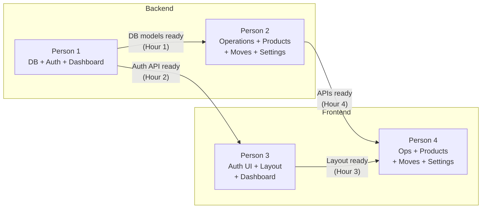

# StockSense — Team Distribution (4 Members × 8 Hours)

## Team Roles

| Member | Role | Focus Area |
|--------|------|------------|
| **Person 1** | Backend Core | Database, Auth, Dashboard, Seed Data |
| **Person 2** | Backend Features | Operations, Products, Move History, Settings APIs |
| **Person 3** | Frontend Core | Scaffolding, Auth pages, Layout, Dashboard UI |
| **Person 4** | Frontend Features | Operations, Products, Move History, Settings pages |

---

## Person 1 — Backend Core

> **Skills needed:** Python, FastAPI, SQLAlchemy, JWT

### Hour 1 (0:00 – 1:00) — Project Setup + Database
- [ ] Create `backend/` folder structure
- [ ] Set up `requirements.txt` (fastapi, uvicorn, sqlalchemy, python-jose, passlib, python-multipart)
- [ ] `pip install -r requirements.txt`
- [ ] Create `database.py` — SQLAlchemy engine + session with SQLite
- [ ] Create `models.py` — ALL 7 tables (users, warehouses, locations, products, operations, operation_lines, move_history)
- [ ] Create `main.py` — FastAPI app with CORS (allow `http://localhost:5173`), mount routers, create tables on startup
- [ ] Verify server starts: `uvicorn main:app --reload --port 8000`

> [!IMPORTANT]
> 🎯 **Checkpoint:** Server runs, `/docs` shows Swagger UI, tables created in SQLite. **Tell Person 2 that models are ready.**

### Hour 2 (1:00 – 2:00) — Authentication
- [ ] Create `auth.py` — JWT create/verify helpers, password hashing (bcrypt)
- [ ] Create `schemas.py` — Pydantic schemas for all request/response types
- [ ] Create `routers/auth_router.py`:
  - `POST /api/v1/auth/signup` — validate login_id (6-12 chars, unique), email (unique), password (8+ chars, upper+lower+special)
  - `POST /api/v1/auth/login` — check credentials, return JWT
  - `GET /api/v1/auth/me` — return user from token
- [ ] Create `get_current_user` dependency for protected routes

> [!IMPORTANT]
> 🎯 **Checkpoint:** Test signup + login via Swagger. **Tell Person 3 that Auth API is ready for frontend integration.**

### Hour 3 (2:00 – 3:00) — Dashboard API + Seed Data
- [ ] Create `routers/dashboard_router.py`:
  - `GET /api/v1/dashboard/stats` — compute KPIs (receipts to receive, late count, delivery stats, product counts)
- [ ] Create `seed.py` — populate demo data:
  - 1 admin user (admin1 / Admin@123)
  - 1 warehouse (Main Warehouse, code: WH)
  - 3 locations (Stock Room 1, Stock Room 2, Loading Dock)
  - 5 products (Desk, Table, Chair, Steel Rod, Monitor)
  - 3 receipts + 2 deliveries in various statuses
  - Matching move history entries
- [ ] Call seed function on app startup (idempotent)

> 🎯 **Checkpoint:** Dashboard stats return correct numbers. Seed data visible in all APIs.

### Hours 4–6 (3:00 – 6:00) — Support + Bug Fixes + Integration
- [ ] Help Person 2 with complex business logic (validate operations, stock updates)
- [ ] Fix bugs found during frontend integration
- [ ] Add any missing Pydantic schemas or response formats that Person 3/4 need
- [ ] Test full auth flow end-to-end with frontend

### Hours 7–8 (6:00 – 8:00) — Polish
- [ ] Final bug fixes
- [ ] Ensure seed data creates a compelling demo
- [ ] Help with demo preparation

---

## Person 2 — Backend Features

> **Skills needed:** Python, FastAPI, business logic

> [!NOTE]
> **Wait for Person 1** to finish database models (Hour 1) before starting router implementation. You can write schema/logic in isolation while waiting.

### Hour 1 (0:00 – 1:00) — Plan & Prepare
- [ ] Review the plan document and understand all state machines
- [ ] Draft the reference number generation logic on paper: `<warehouse_short_code>/<IN|OUT>/<auto_increment_padded_4>`
- [ ] Plan the stock update logic for validate operations

### Hour 2 (1:00 – 2:00) — Operations Router (Part 1)
- [ ] Create `routers/operations_router.py`:
  - `GET /api/v1/operations?type=receipt|delivery&search=` — list operations with filtering
  - `POST /api/v1/operations` — create operation with auto-generated reference + operation_lines
  - `GET /api/v1/operations/{id}` — detail with product names in lines

### Hour 3 (2:00 – 3:00) — Operations Router (Part 2 — State Machine)
- [ ] `PUT /api/v1/operations/{id}` — update operation fields + lines
- [ ] `POST /api/v1/operations/{id}/todo` — Draft → Ready (for delivery: check stock, maybe → Waiting instead)
- [ ] `POST /api/v1/operations/{id}/validate` — Ready → Done:
  - Receipt: **increase** product.on_hand + free_to_use, create move_history (type=in)
  - Delivery: **decrease** product.on_hand + free_to_use, create move_history (type=out), fail if insufficient stock
- [ ] `POST /api/v1/operations/{id}/cancel` — set status to cancelled

### Hour 4 (3:00 – 4:00) — Products + Move History + Settings
- [ ] Create `routers/products_router.py` — full CRUD for products
- [ ] Create `routers/moves_router.py` — list with date range filter + search
- [ ] Create `routers/settings_router.py` — CRUD for warehouses + locations

> [!IMPORTANT]
> 🎯 **Checkpoint:** All APIs functional. Test via Swagger. **Tell Person 4 that all APIs are ready.**

### Hours 5–8 (4:00 – 8:00) — Integration + Bug Fixes
- [ ] Fix API responses based on frontend needs (field names, nested objects, etc.)
- [ ] Handle edge cases (delete warehouse with locations, delete product with operations)
- [ ] Add stock adjustment endpoint if time permits
- [ ] Help with demo preparation

---

## Person 3 — Frontend Core

> **Skills needed:** React, TypeScript, TailwindCSS, React Router

### Hour 1 (0:00 – 1:00) — Project Scaffolding
- [ ] Create Vite + React + TypeScript project: `npm create vite@latest frontend -- --template react-ts`
- [ ] Install deps: `react-router-dom axios lucide-react tailwindcss @tailwindcss/vite`
- [ ] Configure TailwindCSS with Vite plugin
- [ ] Create `src/types/index.ts` — all TypeScript interfaces
- [ ] Create `src/api/client.ts` — Axios instance with JWT interceptor
- [ ] Create `src/context/AuthContext.tsx` — auth state, login/logout functions
- [ ] Set up `src/App.tsx` with React Router (all routes defined, placeholder pages)

> 🎯 **Checkpoint:** `npm run dev` works, routing between placeholder pages works.

### Hour 2 (1:00 – 2:00) — Auth Pages
- [ ] Create `src/pages/auth/LoginPage.tsx`:
  - Centered card, logo, Login ID + Password fields, SIGN IN button
  - Error message display, Forget Password + Sign Up links
- [ ] Create `src/pages/auth/SignupPage.tsx`:
  - Login ID, Email, Password, Re-Enter Password
  - Client-side validation (6-12 char login, 8+ char password with upper/lower/special)
  - Link back to login

> [!IMPORTANT]
> 🎯 **Checkpoint:** Auth pages styled. Once Person 1's Auth API is ready, test full login/signup flow.

### Hour 3 (2:00 – 3:00) — Layout Components
- [ ] Create `src/components/layout/Sidebar.tsx`:
  - Dark sidebar, user avatar, nav menu with icons (lucide-react)
  - Expandable submenus for Operations + Settings
  - Active route highlighting, logout button
- [ ] Create `src/components/layout/TopBar.tsx` — page title + user info
- [ ] Create `src/components/layout/AppLayout.tsx` — sidebar + topbar + Outlet
- [ ] Wire up protected route wrapper (redirect to /login if not auth'd)

> [!IMPORTANT]
> 🎯 **Checkpoint:** Full app shell working. Navigation between pages works. **Tell Person 4 the layout is ready to build pages in.**

### Hour 4 (3:00 – 4:00) — Dashboard Page
- [ ] Create `src/pages/dashboard/DashboardPage.tsx`:
  - Receipt KPI card (blue theme): X to receive, Y late, Z operations
  - Delivery KPI card (amber theme): X to deliver, Y late, Z waiting, W operations
  - Product stat cards: total, low stock, out of stock
- [ ] Integrate with `/dashboard/stats` API

### Hours 5–8 (4:00 – 8:00) — Integration + Polish
- [ ] Help Person 4 with shared components (DataTable, SearchBar, StatusBadge, StatusStepper)
- [ ] Build reusable UI components as Person 4 needs them
- [ ] UI polish: loading states, error handling, toast notifications
- [ ] Responsive tweaks
- [ ] Demo flow preparation

---

## Person 4 — Frontend Features

> **Skills needed:** React, TypeScript, forms, tables

> [!NOTE]
> **Wait for Person 3** to finish the layout (Hour 3) so you can build pages inside the app shell. You can start building page components in isolation while waiting.

### Hours 1–2 (0:00 – 2:00) — Build Components in Isolation
- [ ] Study the Excalidraw wireframes for each page
- [ ] Build page component skeletons (export functions, basic JSX)
- [ ] Build reusable components you'll need:
  - StatusBadge (Draft=gray, Waiting=amber, Ready=blue, Done=green, Cancelled=red)
  - StatusStepper (visual progress: Draft → Ready → Done)
  - SearchBar
  - Empty state component

### Hour 3 (2:00 – 3:00) — Receipt Pages
- [ ] Create `ReceiptsListPage.tsx` — table with Reference, Contact, Schedule Date, Status columns + search + NEW button
- [ ] Create `ReceiptFormPage.tsx` — status stepper, form fields (Receive From, Schedule Date, Responsible), product lines table with add/remove, action buttons (TODO/Validate/Print/Cancel)

### Hour 4 (3:00 – 4:00) — Delivery Pages
- [ ] Create `DeliveryListPage.tsx` — same as receipts list but for deliveries
- [ ] Create `DeliveryFormPage.tsx` — status stepper (4 stages), Delivery Address field, out-of-stock red highlight on product lines

> [!IMPORTANT]
> 🎯 **Checkpoint:** Operations pages functional once Person 2's APIs are ready. Wire up API calls.

### Hour 5 (4:00 – 5:00) — Products/Stock Page
- [ ] Create `StockPage.tsx` — table: Product, SKU, Per Unit Cost, On Hand, Free to Use
- [ ] Add Product modal/form: Name, SKU, Category, Unit, Cost, Stock
- [ ] Edit product (inline or modal), delete product

### Hour 6 (5:00 – 6:00) — Move History Page
- [ ] Create `MoveHistoryPage.tsx`:
  - Date range filter (From/To)
  - Search bar
  - Table with color-coded rows: **green for IN, red for OUT**
  - Columns: Reference, Contact, Product, Quantity, From, To, Date, Status

### Hour 7 (6:00 – 7:00) — Settings Pages
- [ ] Create `WarehousePage.tsx` — CRUD form + list table
- [ ] Create `LocationPage.tsx` — CRUD form with warehouse dropdown + list table

### Hour 8 (7:00 – 8:00) — Polish + Integration
- [ ] Wire up all remaining API calls
- [ ] Fix any integration issues
- [ ] Polish UI details
- [ ] Help with demo preparation

---

## Integration Checkpoints (All 4 Members Together)

| Time | Checkpoint | Who Syncs |
|------|-----------|-----------|
| **Hour 1 end** | DB models ready, frontend scaffolded | P1 → P2, P3 verifies dev server |
| **Hour 2 end** | Auth API works, Auth UI styled | P1 ↔ P3 test login flow |
| **Hour 3 end** | Layout done, Dashboard API ready | P3 → P4 (layout ready), P1 → P3 (dashboard API) |
| **Hour 4 end** | All backend APIs done | P2 → P4 (wire up operations/products/moves/settings) |
| **Hour 6 end** | All pages functional | Full team integration test |
| **Hour 8** | Final demo | Everyone: bug fixes, seed data, demo script |

---

## Quick Reference: Who Owns What

| Page/Feature | Backend | Frontend |
|-------------|---------|----------|
| Database + Models | **Person 1** | — |
| Auth (signup/login) | **Person 1** | **Person 3** |
| Dashboard | **Person 1** | **Person 3** |
| Sidebar + Layout | — | **Person 3** |
| Receipts | **Person 2** | **Person 4** |
| Deliveries | **Person 2** | **Person 4** |
| Products/Stock | **Person 2** | **Person 4** |
| Move History | **Person 2** | **Person 4** |
| Settings (WH + Locations) | **Person 2** | **Person 4** |
| Seed Data | **Person 1** | — |
| Polish + Demo | **Everyone** | **Everyone** |
