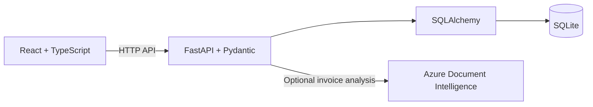

# StockSense

**A clearer view of inventory.**

StockSense is an inventory management application for tracking products, incoming shipments, outbound deliveries, and stock across warehouses and storage locations. It brings daily inventory work into one workspace, with operation references, movement history, stock health indicators, and an optional supplier invoice import workflow.

Built as a hackathon project, StockSense combines a React and TypeScript frontend with a FastAPI backend and a SQLite database. The current application is intended for local development and demonstrations; deployment limitations are documented below.

## Contents

- [Features](#features)
- [Architecture](#architecture)
- [Getting started](#getting-started)
- [Demo data and accounts](#demo-data-and-accounts)
- [Configuration](#configuration)
- [Supplier invoice import](#supplier-invoice-import)
- [API overview](#api-overview)
- [Testing and verification](#testing-and-verification)
- [Project structure](#project-structure)
- [Current limitations](#current-limitations)
- [Troubleshooting](#troubleshooting)
- [Contributing](#contributing)

## Features

| Area | Current functionality |
|---|---|
| Dashboard | Inventory value, SKU counts, low-stock indicators, pending operations, recent activity, and a seven-day movement chart. |
| Product catalog | Product creation and search, SKU identification, cost and reorder metadata, and aggregated stock totals. Metadata update and soft-delete endpoints are also available. |
| Stock by location | Inventory grouped by warehouse and location, with quantities, available stock, valuation, and search. |
| Receipts | Multiple product lines, explicit warehouse and destination selection, and Draft → Ready → Done processing. |
| Deliveries | Outbound orders, source selection, stock availability checks, and stock deduction on validation. |
| Transfers | Operations that move quantities from a source location to a destination. |
| Adjustments | Physical-count operations with a recorded reason. See the current zero-count limitation below. |
| Move history | Movement references, products, quantities, contacts, directions, dates, and search. |
| Warehouse settings | List and create warehouses and locations. New warehouses receive a default General Stock location. |
| Inventory intelligence | Rule-based stock health, reorder suggestions, and alerts for low stock and pending or overdue operations. |
| Authentication | Password login, signup with email OTP verification, session restoration, and logout. |
| Supplier invoice import | Optional Azure invoice extraction, exact SKU suggestions, editable review, and confirmation of quantities actually received. |

## Architecture



| Layer | Technologies |
|---|---|
| Frontend | React 19, TypeScript, Vite 8, React Router 7, Tailwind CSS 4, Lucide icons |
| Backend | FastAPI, Pydantic 2, SQLAlchemy 2, Uvicorn |
| Storage | SQLite for the local application |
| Authentication | bcrypt password hashing and JWT bearer tokens |
| Invoice analysis | Azure AI Document Intelligence Python SDK, `prebuilt-invoice` |
| Tests | pytest, Vitest, Testing Library, and Playwright |

### Inventory model

Stock is stored per **product and location** in `Inventory`. Product totals are calculated from those inventory records; updating product metadata does not edit stock.

Saving an operation does not change inventory. Validation applies its stock changes and creates movement records. For receipts, inventory updates, all line movements, and the Done status commit together; a failure rolls back the transaction. A completed operation cannot be validated a second time.

The receipt workflow is:

```text
Create Draft → Review → Mark Ready → Validate & Receive → Done
                                          │
                                          └─ Update inventory and movement history
```

Deliveries currently start Ready or Waiting according to stock availability. The receipt TODO action is not a universal state transition for other operation types.

## Getting started

### Prerequisites

- **Python 3.11 or later**.
- **Node.js 24.15+ within the 24.x release line, or 26.x**. Node 22.22.2+ within 22.x also satisfies the current locked dependencies.
- npm and Git.
- An Azure Document Intelligence resource only if you want live invoice import.

The active frontend is at the **repository root**, under `src/`. Run frontend commands there. The separate `frontend/` directory contains legacy code and is not the application documented here.

### 1. Clone the repository

```bash
git clone https://github.com/saranshlulla42/StockSense.git
cd StockSense
```

### 2. Install dependencies

```bash
npm ci
python3 -m venv .venv
```

On Windows, use `python -m venv .venv` if `python3` is unavailable.

Activate your new Python environment:

```bash
# macOS / Linux
source .venv/bin/activate
```

```powershell
# Windows PowerShell
.\.venv\Scripts\Activate.ps1
```

Then install the backend and test dependencies:

```bash
python -m pip install -r backend/requirements-dev.txt
```

Create your own root `.venv`; the existing `backend/.venv` directory is a Windows environment checked into the repository and should not be reused across machines.

### 3. Configure and initialize the backend

Create `backend/.env` if it does not already exist. An empty file is sufficient for basic local use. Preserve existing settings if the file is already present. SMTP and Azure configuration are optional.

The database defaults to `backend/stocksense.db`. Initialize any missing tables without deleting existing records:

```bash
python -c "import sys; sys.path.insert(0, 'backend'); from dotenv import load_dotenv; load_dotenv('backend/.env'); from models import Base, engine; Base.metadata.create_all(bind=engine)"
```

The app does not automatically create tables or seed data at startup. For a separate database with sample products and operations, follow [Demo data and accounts](#demo-data-and-accounts).

### 4. Start the API

From the repository root, with the Python environment activated:

```bash
python -m uvicorn backend.main:app --env-file backend/.env --reload
```

| Service | Local URL |
|---|---|
| API | http://localhost:8000 |
| Interactive API documentation | http://localhost:8000/docs |
| OpenAPI specification | http://localhost:8000/openapi.json |
| Health check | http://localhost:8000/health |

### 5. Start the frontend

Open a second terminal at the repository root:

```bash
npm run dev
```

Open **http://localhost:5173**. Sign in with a seeded account, or create an account and verify its OTP. Without SMTP configuration, the development backend prints verification codes in its terminal.

## Demo data and accounts

The seed script **drops and recreates every table in its configured database**. Use a dedicated demo database to preserve your working data.

With the root Python environment activated, the following command creates or resets a separate database inside the ignored `.venv` directory:

```bash
python -c "import os, sys; from pathlib import Path; os.environ['DATABASE_URL'] = 'sqlite:///' + (Path.cwd() / '.venv' / 'stocksense-demo.db').as_posix(); sys.path.insert(0, 'backend'); from seed import seed_database; seed_database()"
```

To use that database, set `DATABASE_URL` in `backend/.env` to its absolute path and restart the API:

```dotenv
# macOS / Linux example — replace with your actual repository path
DATABASE_URL=sqlite:////absolute/path/to/StockSense/.venv/stocksense-demo.db

# Windows equivalent: sqlite:///C:/path/to/StockSense/.venv/stocksense-demo.db
```

The seed script creates these verified **demo-only** accounts:

| Role | Email | Login ID | Password |
|---|---|---|---|
| Inventory manager | `manager@stocksense.io` | `manager1` | `Admin@123` |
| Warehouse staff | `staff@stocksense.io` | `staff01` | `Staff@123` |

The API accepts either email or login ID as the login `identifier`; the current login screen uses email. These credentials apply to the database created by the seed script, not necessarily to an existing database.

## Configuration

Backend variables belong in **`backend/.env`**. Frontend variables belong in a root **`.env.local`**. Restart the relevant development server after changing configuration.

| Variable | Location | Purpose / default |
|---|---|---|
| `DATABASE_URL` | Backend | SQLAlchemy database URL. Defaults to the absolute path of `backend/stocksense.db`. |
| `SMTP_HOST` | Backend | Optional SMTP server for OTP email. |
| `SMTP_PORT` | Backend | SMTP port; defaults to `587`. |
| `SMTP_USER` | Backend | SMTP username and sender address. |
| `SMTP_PASSWORD` | Backend | SMTP password or provider-specific app password. |
| `AZURE_DOCUMENT_INTELLIGENCE_ENDPOINT` | Backend | Optional Azure resource endpoint for invoice analysis. |
| `AZURE_DOCUMENT_INTELLIGENCE_KEY` | Backend | Optional Azure resource key. |
| `VITE_API_URL` | Frontend | API origin; defaults to `http://localhost:8000`. Do not append `/api/v1`. |

Example frontend override:

```dotenv
# .env.local
VITE_API_URL=http://localhost:8000
```

Only configure SMTP with real working credentials; leave those variables unset for console OTP delivery. The existing [backend environment example](backend/.env.example) contains SMTP placeholders that need review before use.

Azure keys and SMTP credentials must remain backend-only. `VITE_*` values are included in the browser application. The current authentication code also hardcodes its development JWT signing key: setting `SECRET_KEY` in an environment file does **not** override that implementation yet.

## Supplier invoice import

Invoice import helps prepare a receipt. It does not automatically create an operation, change stock, or generate movement history.

To enable live analysis, create an Azure Document Intelligence resource and add its endpoint and key to `backend/.env`:

```dotenv
AZURE_DOCUMENT_INTELLIGENCE_ENDPOINT=https://YOUR-RESOURCE.cognitiveservices.azure.com/
AZURE_DOCUMENT_INTELLIGENCE_KEY=YOUR-RESOURCE-KEY
```

Restart the backend, then use **Receipts → New Receipt → Import supplier invoice**:

1. Select an invoice and click **Extract suggestions**.
2. Review the supplier and product suggestions; resolve unmatched products manually.
3. Enter quantities actually received, exclude unwanted or duplicate lines, and confirm the review.
4. Add the reviewed lines to the receipt and select its warehouse, destination, and scheduled date.
5. Save the Draft, mark it Ready, and validate when ready to receive stock.

| Input rule | Limit |
|---|---|
| Formats | PDF, JPEG/JPG, PNG |
| File size | 4 MiB / 4,194,304 bytes, displayed as 4 MB |
| PDF length | One or two pages; longer documents are rejected |
| PDF protection | Encrypted PDFs are rejected |
| Image dimensions | 50–10,000 pixels on each side |
| Animated images | Not supported |

File content is decoded and checked before analysis; filename extensions and browser MIME alone are not trusted. Product matching uses only an unambiguous exact SKU after trimming outer whitespace and lowercasing. Confidence scores do not automatically approve suggestions.

Invoice date does not replace the scheduled receipt date. Invoice number and date appear in review but are not persisted on the receipt. Uploads are not intentionally stored by StockSense. If Azure is unavailable or unconfigured, the form still supports manual entry.

See the [invoice import guide](docs/invoice-import.md) for response fields, validation errors, timeout behavior, setup details, and verification results. Live Azure verification remains pending until credentials and a suitable sample invoice are available.

## API overview

The API uses the `/api/v1` prefix. The following routes reflect the current backend implementation; Swagger at `/docs` provides the complete generated reference.

| Area | Routes |
|---|---|
| Authentication | `POST /auth/signup`, `POST /auth/login`, `POST /auth/verify-otp`, `POST /auth/resend-otp`, `GET /auth/me` |
| Dashboard | `GET /dashboard/kpis`, `GET /dashboard/data` |
| Products | `GET /products`, `POST /products`, `GET /products/{id}`, `PUT /products/{id}`, `DELETE /products/{id}` |
| Location stock | `GET /stock/by-location` |
| Operations | `GET /operations`, `POST /operations`, `GET /operations/{id}`, `POST /operations/{id}/todo`, `POST /operations/{id}/validate`, `POST /operations/{id}/cancel` |
| Move history | `GET /moves` |
| Warehouses | `GET /warehouses`, `POST /warehouses` |
| Locations | `GET /locations`, `POST /warehouses/{id}/locations` |
| Inventory intelligence | `GET /intelligence/inventory-health`, `GET /intelligence/smart-reorder`, `GET /intelligence/action-center` |
| Invoice import | `GET /invoice-import/config`, `POST /invoice-import/analyze` |

The invoice analysis endpoint accepts a multipart file in the `file` field. Operation lists support type, status, and reference/contact search. Move history supports move type, product, and text search. Product deletion currently deactivates the product rather than deleting its records.

Operations, invoice import, and the current-user endpoint require `Authorization: Bearer <token>`. Other application routers do not yet consistently enforce authentication. The frontend's protected routes do not substitute for backend authorization.

## Testing and verification

From the repository root, with the Python environment activated:

```bash
python -m pytest -q
npm test
npx tsc -b
npm run build
npm run lint
```

The backend tests use temporary SQLite databases and dependency overrides. Azure is mocked; automated tests require no live Azure account and do not modify the normal demo database.

For the complete invoice browser flow:

```bash
npx playwright install chromium
```

```bash
# macOS / Linux
TEST_PYTHON=.venv/bin/python npm run test:invoice-e2e
```

```powershell
# Windows PowerShell
$env:TEST_PYTHON = '.venv\Scripts\python.exe'
npm run test:invoice-e2e
```

This test starts the real frontend and API on test-owned ports **5174** and **8765**, uses real authentication and fake Azure, and creates a disposable database. It checks invoice review, Draft → Ready → Done, stock and history changes, repeat validation, a subsequent delivery, responsive widths, and keyboard behavior. Set `BROWSER_EXECUTABLE` to use an existing Chromium-compatible browser instead of Playwright's downloaded Chromium.

Latest recorded verification: **67 backend tests and 7 frontend tests passed**, along with the browser flow, TypeScript check, and root build. Lint exits successfully with 21 existing warnings. Backend tests also report existing dependency and `datetime.utcnow()` deprecation warnings. These results cover the current test suite, not every screen or all operation edge cases.

`npm run build` produces the active frontend in `dist/`. Use `npm run preview` to inspect that build locally; the API must still run separately.

## Project structure

```text
StockSense/
├── src/                          # Active React frontend
│   ├── api/                      # Shared HTTP client and API contracts
│   ├── components/               # Layout and reusable UI components
│   ├── context/                  # Authentication state
│   ├── pages/                    # Application and authentication screens
│   │   └── receipts/             # Receipt form, invoice review, and tests
│   └── test/                     # Frontend test setup
├── backend/
│   ├── main.py                   # FastAPI application and router registration
│   ├── models.py                 # ORM models, session, and stock utilities
│   ├── schemas.py                # Pydantic API schemas
│   ├── auth.py                   # Authentication and DB dependency
│   ├── routers/                  # API route modules
│   ├── invoice_import.py         # File validation and Azure suggestion service
│   ├── seed.py                   # Destructive demo seeder
│   └── tests/                    # Isolated API and stock-flow tests
├── tests/                        # Browser integration script
├── docs/                         # Feature setup and handoff documentation
├── Artifacts/                    # Original plans and design references
├── frontend/                     # Legacy frontend; not the active application
├── frontend-agent.md             # Current frontend design and component guide
├── AGENTS.md                     # Repository instructions
├── package.json                  # Root frontend scripts and dependencies
├── pytest.ini                    # Backend test discovery
└── vitest.config.ts              # Frontend test configuration
```

## Current limitations

StockSense is a development and hackathon application. The following gaps should be considered when extending it:

- **Deployment security:** the JWT key is hardcoded, CORS permits all origins, OTPs are printed and returned through demo responses, and several routers lack authentication. Account roles exist but comprehensive role-based authorization is not implemented.
- **Database management:** there is no versioned migration workflow. The seed script resets its target database; SQLite is the verified local storage path.
- **Operation editing:** there is no operation update endpoint. The receipt TODO action supports Draft → Ready only; delivery Waiting → Ready rechecks are not implemented as a separate action.
- **Smart Reorder:** suggestions are available, but the one-click receipt action currently omits the warehouse ID required by receipt creation. Create the receipt through the regular form until that action is integrated.
- **Adjustments and history:** the current adjustment form cannot submit a zero physical count because the shared line quantity requires a positive value. Adjustment movement quantities are stored as absolute values; a signed movement delta is not exposed. Transfers currently generate separate debit and credit movement records.
- **Settings and profile:** warehouse/location update and delete routes are absent. Profile editing and password changes are disabled in the UI. Move history has no backend date-range filter.
- **Legacy frontend:** `frontend/` has no `index.html` and does not build as a standalone application. Use the root frontend.

## Troubleshooting

| Symptom | What to check |
|---|---|
| An old interface appears | Start `npm run dev` from the root containing `src/` and `index.html`. Check for another server using port 5173. |
| API requests fail | Confirm the API is running on port 8000 and `/health` responds. Check `VITE_API_URL`, then restart Vite if it changed. |
| `no such table` from SQLite | Run the non-destructive table initialization command against the same `DATABASE_URL` used by Uvicorn. |
| Demo credentials fail | Confirm you are using the dedicated seeded database. Existing databases may have different accounts. |
| Signup is waiting for an OTP | Read the backend terminal during local development, or check the configured SMTP inbox. |
| Invoice import returns 503 | Check both Azure variables and restart the API. Continue with manual receipt entry while import is unavailable. |
| Draft receipt validation is rejected | Use **Mark Ready** before **Validate & Receive**. |
| Dependency installation reports unsupported Node | Use a Node release listed under prerequisites; the locked test dependencies require a newer version than Vite alone. |
| Browser test cannot start | Ensure ports 5174/8765 are free, `TEST_PYTHON` points to the installed environment, and a Playwright browser is installed. |

## Contributing

Read [AGENTS.md](AGENTS.md) and [frontend-agent.md](frontend-agent.md) before making changes. Build frontend components in the root `src/` application and reuse the shared UI primitives.

Keep stock changes in operation validation, preserve movement history, and test business logic with isolated databases. Before submitting a change, run the relevant tests, type check, build, and lint; document any API changes and remaining integration work.

The original [implementation plan](Artifacts/stocksense_plan.md), [team distribution](Artifacts/team_distribution.md), and [route guide](route.md) provide project context. Some describe proposed behavior; use the current code and generated API documentation to confirm the implemented contract.
